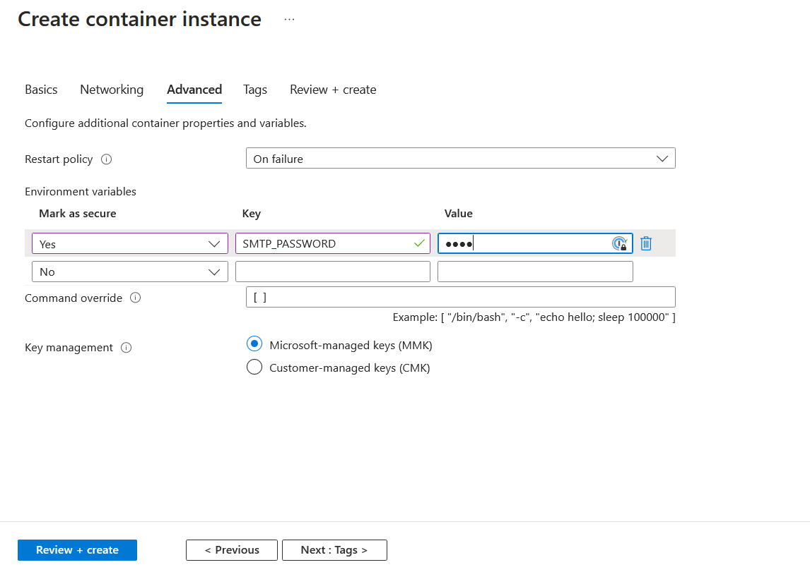

# Epost

Denne oppgaven var Eksamensoppgaven min i IT på F21 2023
Eksamensoppgave: "Ta utgangspunkt i et IT-Prosjekt du har hatt i løpået av skoleåret og videreutvikle dette."

Jeg forsøkte å vise kompetanse innen flere fagområder!

* Flask Webserver
* Docker Container
* Docker Hub
* Dockerfile
* Docker Compose

* Azure webhosting (container services)

## Hva var målet?

Målet med oppgaven min var å lage en webserver som kan sende Mail og embede ett bilde (tracking image) slik at når noen åpner mailen vil min webserver få en GET request og jeg kan registrere at noen har åpnet mailen min.

For at get requesten skal kunne nås fra internett valgte jeg å hoste Webserveren på Azure Container Instances.

## Hvordan sette opp en container i Azure Container Instances




## Tag and push

For å laste opp ett nytt docker image til docker hub må man først bygge imaget, tagge og så pushe imaget til docker hub.

Utfør i rekkefølge, husk å endre versjonstall (1.0.0)
Husk å docker compose før du gjør dette
Du må være logget inn i Docker Desktop

```bash
docker tag epost-flask-server:latest olischio/email-tracker:1.0.5
docker push olischio/email-tracker:1.0.5
```

Dette skal velges i Azure Container Instances på image, husk å endre versjonstall
olischio/email-tracker:1.0.5
Login server
index.docker.io

Token har read only access til docker hub kontoen min, men jeg ønsket å teste med ett privat Docker-Image Repository.
Token - dckr_pat_jAoBj0ZOEUw8eo3oyVyW9JLy8LU

Når du setter opp Azure container må du sette opp port 5000 tcp og fjerne den gamle
Sett opp Env variabler i Azure


  
