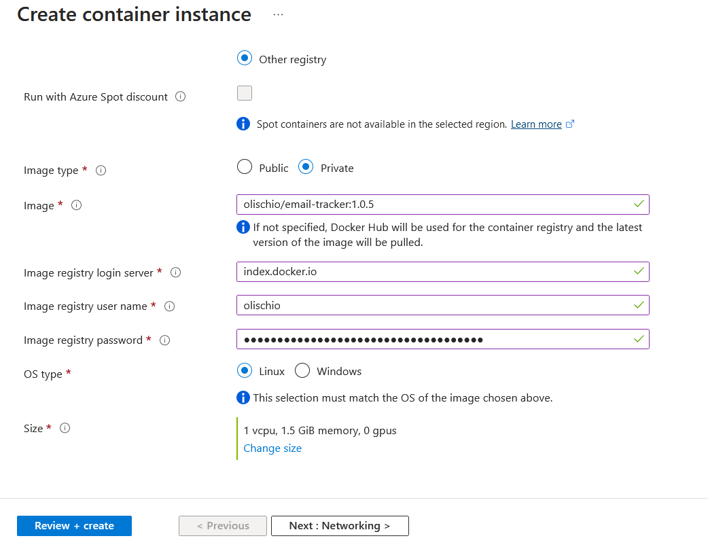
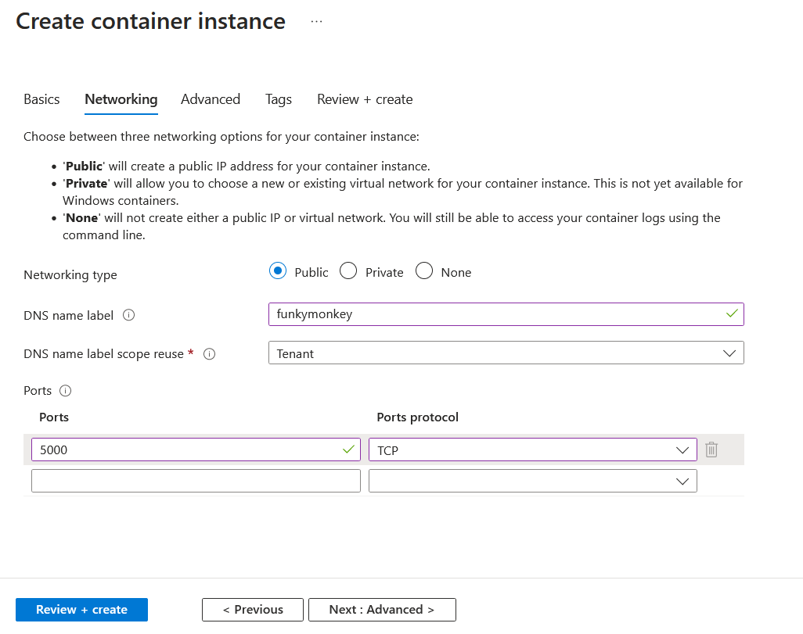

# Epost

Denne oppgaven var Eksamensoppgaven min i IT på F21 2023

Jeg forsøkte å vise kompetanse innen flere fagområder.
Dette prosjektet inneholder:

* Flask python server
* Docker Container
* Docker Hub
* Dockerfile
* Docker Compose

* Azure webhosting (container services)

## Hvordan sette opp en container i Azure Container Instances





## Tag and push

Utfør i rekkefølge, husk å endre versjonstall (1.0.0)
Husk å docker compose før du gjør dette
Du må være logget inn i Docker Desktop

NÅR DU ER PÅ SKOLE PCEN MÅ DET STÅ tag epost-1-flask-server

```bash
docker tag epost-flask-server:latest olischio/email-tracker:1.0.5
docker push olischio/email-tracker:1.0.5
```

Dette skal velges i Azure image, husk å endre versjonstall
olischio/email-tracker:1.0.5
Login server
index.docker.io

Token har read only access til docker hub kontoen min så det er for mye styr å fjerne den herifra
Token - dckr_pat_jAoBj0ZOEUw8eo3oyVyW9JLy8LU

Når du setter opp Azure container må du sette opp port 5000 tcp og fjerne den gamle
Sett opp Env variabler i Azure

## Tracking Pixel For Epost

##Installere Flask

*Serveren skal hoste ett bilde av en tracking pixel (eller annet bilde slik at man kan se det)
*Serveren skal ha: Muligheten til å serve ett bilde, Sende en Epost ved bruk av Python (outlook har ekstrapassord for dette)
  *App-passord


  
